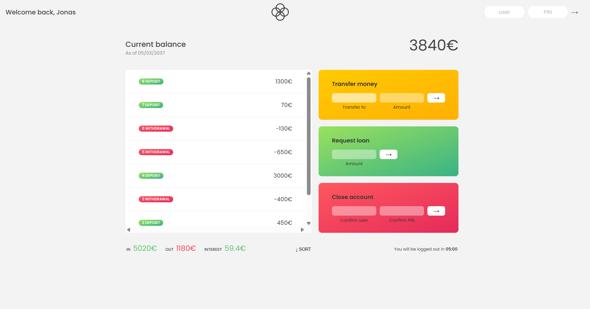

# Bankist JS App

A fake banking application to practice DOM manipulation, events, and account operations.

## Features

- View accounts and transactions
- Deposit and withdraw money
- Transfer money between accounts
- Sort and filter transactions

## Tech Stack

- JavaScript (ES6+)
- HTML & CSS
- DOM & Events

### 📝 Note

This project is part of the **JavaScript Course by Jonas Schmedtmann**.

---

## 🖼️ Screenshots

### Main Page

